# 🌿 Organi — Fresh Product E-Commerce

<div align="center">


**Organi**, Clean Architecture prensiplerine uygun geliştirilmiş, organik ürün yönetimi için tasarlanmış bir ASP.NET Core full-stack projesidir. Projede 5 farklı tasarım deseni bir arada kullanılmıştır.

</div>

---

## 📋 İçindekiler

- [Proje Hakkında](#-proje-hakkında)
- [Clean Architecture](#-clean-architecture)
- [Katman Yapısı](#-katman-yapısı)
- [Tasarım Desenleri](#-tasarım-desenleri)
  - [Repository Pattern](#1-repository-pattern)
  - [Unit of Work](#2-unit-of-work)
  - [CQRS + MediatR](#3-cqrs--mediatr)
  - [Chain of Responsibility](#4-chain-of-responsibility)
  - [Observer Pattern](#5-observer-pattern)
- [Tüm Desenler Birlikte](#-tüm-desenler-birlikte)
- [Özellikler](#-özellikler)
- [Proje Görselleri](#-proje-görselleri)

---

## 🌱 Proje Hakkında

Organi, organik ürünlerin yönetildiği full-stack bir e-ticaret projesidir. Ürün ekleme, silme, güncelleme ve listeleme işlemlerinin yanı sıra sepet yönetimi, stok takibi ve ürün besin değeri karşılaştırması gibi özellikler sunar.

### Kullanılan Teknolojiler

| Teknoloji | Amaç |
|-----------|------|
| ASP.NET Core 8 | Web API & MVC |
| Entity Framework Core | ORM / Veritabanı |
| MediatR | CQRS ve Observer |
| AutoMapper | Entity → DTO dönüşümü |
| SQL Server | Veritabanı |
| Swagger | API dokümantasyonu |
| Bootstrap | UI Framework |

---

## 🏛 Clean Architecture

Clean Architecture, bağımlılıkların her zaman **dışarıdan içeriye** doğru aktığı bir mimari yaklaşımdır. İç katmanlar dış katmanları **hiçbir zaman** tanımaz.

```
╔══════════════════════════════════════════════════════╗
║                    WebUI/WebAPI (Sunum)              ║  ← En dışta
║  ┌────────────────────────────────────────────────┐  ║
║  │            Infrastructure (Altyapı)            │  ║
║  │  ┌──────────────────────────────────────────┐  │  ║
║  │  │          Persistence (Veri)              │  │  ║
║  │  │  ┌────────────────────────────────────┐  │  │  ║
║  │  │  │       Application (İş Mantığı)     │  │  │  ║
║  │  │  │  ┌──────────────────────────────┐  │  │  │  ║
║  │  │  │  │     Domain (Çekirdek)        │  │  │  │  ║
║  │  │  │  │  Entity · Interface · Rule   │  │  │  │  ║
║  │  │  │  └──────────────────────────────┘  │  │  │  ║
║  │  │  └────────────────────────────────────┘  │  │  ║
║  │  └──────────────────────────────────────────┘  │  ║
║  └────────────────────────────────────────────────┘  ║
╚══════════════════════════════════════════════════════╝
                  Bağımlılık yönü: → içe doğru
```

### Bağımlılık Kuralı

```
WebAPI/WebUI  →  Application, Domain
Infrastructure →  Application, Domain
Persistence   →  Application, Domain
Application   →  Domain
Domain        →  Hiçbir şeye bağımlı değil 
```

---

## 📁 Katman Yapısı

```
Organi/
│
├── Organi.Domain/                    # Çekirdek katman
│   ├── Entities/
│   │   ├── About.cs
│   │   ├── Basket.cs
│   │   ├── Category.cs
│   │   ├── Product.cs
│   │   ├── ProductNutrition.cs
│   │   ├── Slider.cs
│   │   └── Testimonial.cs
│   └── Interfaces/
│       ├── IAboutRepository.cs
│       ├── IBasketRepository.cs
│       ├── ICategoryRepository.cs
│       ├── IProductNutritionRepository.cs
│       ├── IProductRepository.cs
│       ├── ISliderRepository.cs
│       ├── ITestimonialRepository.cs
│       └── IUnitOfWork.cs
│
├── Organi.Application/               # İş mantığı katmanı
│   ├── Features/
│   │   ├── Products/
│   │   │   ├── Chain/               # Chain of Responsibility
│   │   │   │   ├── Abstract/
│   │   │   │   │   ├── ProductHandler.cs
│   │   │   │   │   └── IValidationChainFactory.cs
│   │   │   │   ├── Factories/
│   │   │   │   │   └── ValidationChainFactory.cs
│   │   │   │   └── Handlers/
│   │   │   │       ├── PriceValidationHandler.cs
│   │   │   │       ├── ProductNameValidationHandler.cs
│   │   │   │       └── StockValidationHandler.cs
│   │   │   ├── Commands/
│   │   │   │   ├── CreateProductCommand.cs
│   │   │   │   ├── UpdateProductCommand.cs
│   │   │   │   └── RemoveProductCommand.cs
│   │   │   ├── Queries/
│   │   │   │   ├── GetProductsQuery.cs
│   │   │   │   ├── GetProductByIdQuery.cs
│   │   │   │   └── GetProductsWithFilterQuery.cs
│   │   │   ├── DTOs/
│   │   │   │   └── ResultProductDto.cs
│   │   │   ├── Events/              # Observer Events
│   │   │   │   ├── ProductAddedEvent.cs
│   │   │   │   └── ProductRemovedEvent.cs
│   │   │   └── Handlers/
│   │   │       ├── CreateProductCommandHandler.cs
│   │   │       ├── ProductAddedEventHandler.cs
│   │   │       ├── ProductAddedStockHandler.cs
│   │   │       ├── ProductRemovedEventHandler.cs
│   │   │       └── ProductRemovedStockHandler.cs
│   │   ├── Baskets/
│   │   │   ├── Commands/
│   │   │   │   ├── CreateBasketCommand.cs
│   │   │   │   ├── UpdateBasketCommand.cs
│   │   │   │   └── RemoveBasketCommand.cs
│   │   │   ├── Events/
│   │   │   │   ├── BasketItemAddedEvent.cs
│   │   │   │   └── BasketItemRemovedEvent.cs
│   │   │   └── Handlers/
│   │   │       ├── CreateBasketCommandHandler.cs
│   │   │       ├── BasketItemAddedEventHandler.cs
│   │   │       └── BasketItemRemovedEventHandler.cs
│   │   ├── Categories/
│   │   ├── Abouts/
│   │   ├── Sliders/
│   │   ├── ProductNutritions/
│   │   ├── Dashboard/
│   │   └── Testimonials/
│   ├── Interfaces/
│   │   └── Services/
│   │       └── IStockService.cs
│   └── Mapping/
│       └── GeneralMappingProfile.cs
│
├── Organi.Infrastructure/            # Dış servisler katmanı
│   └── Services/
│       └── StockService.cs
│
├── Organi.Persistence/               # Veri erişim katmanı
│   ├── Context/
│   │   └── OrganiDbContext.cs
│   ├── Repositories/
│   │   ├── AboutRepositories/
│   │   ├── BasketRepositories/
│   │   ├── CategoryRepositories/
│   │   ├── ProductNutritionRepositories/
│   │   ├── ProductRepositories/
│   │   ├── SliderRepositories/
│   │   └── TestimonialRepositories/
│   ├── UnitOfWork/
│   │   └── UnitOfWork.cs
│   └── Migrations/
│
├── Organi.WebAPI/                    # API katmanı
│   ├── Controllers/
│   │   ├── AboutsController.cs
│   │   ├── BasketsController.cs
│   │   ├── CategoriesController.cs
│   │   ├── DashboardController.cs
│   │   ├── ProductNutritionsController.cs
│   │   ├── ProductsController.cs
│   │   ├── SlidersController.cs
│   │   └── TestimonialsController.cs
│   └── Program.cs
│
└── Organi.WebUI/                     # MVC katmanı
    ├── Controllers/
    ├── Views/
    └── wwwroot/
```

---

## 🎨 Tasarım Desenleri

### 1. Repository Pattern

> **Amaç:** Veritabanı işlemlerini soyutlamak, iş mantığını veri erişim detaylarından izole etmek.

```
┌─────────────────────────────────────────────────┐
│              Command/Query Handler               │
│                                                 │
│   var products = await _repository.GetAllAsync()│
│        ↓ Sadece interface'i biliyor             │
└──────────────────┬──────────────────────────────┘
                   │ IProductRepository
                   ↓
┌─────────────────────────────────────────────────┐
│              ProductRepository                  │
│                                                 │
│   _context.Products                             │
│       .Include(x => x.Category)                 │
│       .ToListAsync()          ← Detay burada   │
└─────────────────────────────────────────────────┘
```

**Organi'de Kullanımı:**

```csharp
// Domain katmanında sadece kural tanımlanır
public interface IProductRepository
{
    Task<List<Product>> GetAllAsync();
    Task<Product> GetByIdAsync(int id);
    Task AddAsync(Product product);
    Task UpdateAsync(Product product);
    Task DeleteAsync(Product product);
    Task<List<Product>> GetProductsWithFilterAsync(
        int? categoryId, decimal? minPrice,
        decimal? maxPrice, string searchTerm);
    Task<int> ProductCountAsync();
    Task<int> LowStockCountAsync(int threshold = 30);
    Task<List<Product>> RecentProducts();
    Task<List<Product>> GetProductsWithCategoryAsync();
}

// Persistence katmanında detay implemente edilir
public class ProductRepository : IProductRepository
{
    public async Task<List<Product>> GetProductsWithFilterAsync(...)
    {
        var query = _context.Products
            .Include(x => x.Category)
            .AsQueryable();         // ← DB'de filtrele, bellekte değil

        if (categoryId.HasValue)
            query = query.Where(x => x.CategoryId == categoryId);
        // ...
        return await query.ToListAsync();
    }
}
```

**Kazanım:** EF Core → Dapper gibi bir geçişte sadece Repository implementasyonu değişir, Handler'lara dokunulmaz.

---

### 2. Unit of Work

> **Amaç:** Birden fazla repository işlemini tek bir transaction altında toplamak, "ya hep ya hiç" garantisi vermek.

```
┌──────────────────────────────────────────────────────────────┐
│                   IUnitOfWork                                │
│                                                              │
│   IProductRepository Products { get; }                       │
│   ICategoryRepository Categories { get; }                    │
│   IBasketRepository Baskets { get; }                         │
│   IProductNutritionRepository ProductNutritions { get; }     │
│   ISliderRepository Sliders { get; }                         │
│   IAboutRepository Abouts { get; }                           │
│   ITestimonialRepository Testimonials { get; }               │
│                                                              │
│   Task<int> SaveChangesAsync();  ← Tek nokta                 │
└──────────────────────────────────────────────────────────────┘
                         ↓
         Tüm işlemler tek SaveChanges ile commit edilir

┌─────────────────────────────────────────────────────┐
│  ✅ Başarı Senaryosu                                │
│  Basket eklendi  →  Stock güncellendi  →  Commit    │
├─────────────────────────────────────────────────────┤
│  ❌ Hata Senaryosu                                  │
│  Basket eklendi  →  Stock HATA  →  Rollback         │
│  İkisi de geri alınır, yarım veri kalmaz            │
└─────────────────────────────────────────────────────┘
```

**Organi'de Kullanımı:**

```csharp
// Command Handler'larda → UnitOfWork kullanılır (yazma işlemi)
public async Task Handle(CreateBasketCommand request, CancellationToken ct)
{
    await _unitOfWork.Baskets.AddAsync(basket);
    await _unitOfWork.SaveChangesAsync();    // ← tek commit noktası
}

// Query Handler'larda → Direkt Repository kullanılır (sadece okuma)
public async Task Handle(GetProductsQuery request, CancellationToken ct)
{
    var products = await _repository.GetAllAsync();  // SaveChanges yok
    return _mapper.Map<List<ResultProductDto>>(products);
}
```

---

### 3. CQRS + MediatR

> **Amaç:** Okuma (Query) ve yazma (Command) işlemlerini birbirinden ayırmak. Her işlemin tek sorumluluğu olmasını sağlamak.

```
HTTP Request
     │
     ├── POST / PUT / DELETE
     │        ↓
     │   [ COMMAND ]              Veriyi değiştirir
     │   CreateProductCommand     UnitOfWork kullanır
     │   UpdateProductCommand     Observer tetikler
     │   RemoveProductCommand
     │
     └── GET
              ↓
         [ QUERY ]                Sadece okur
         GetProductsQuery         Repository kullanır
         GetProductByIdQuery      UnitOfWork kullanmaz
         GetProductsWithFilterQuery


┌──────────────────────────────────────────────────────┐
│                    MediatR Pipeline                  │
│                                                      │
│  Controller          Handler           Repository    │
│  ──────────          ───────           ──────────    │
│  mediator.Send()  →  Handle()       →  GetAllAsync() │
│  mediator.Publish()→  Handle()      →  (Observer)    │
└──────────────────────────────────────────────────────┘
```

**Organi'de Kullanımı:**

```csharp
// Controller sadece MediatR'a iş devreder
[HttpGet]
public async Task<IActionResult> GetAllProducts(
    [FromQuery] int? categoryId,
    [FromQuery] decimal? minPrice,
    [FromQuery] string searchTerm)
{
    var result = await _mediator.Send(new GetProductsWithFilterQuery
    {
        CategoryId = categoryId,
        MinPrice   = minPrice,
        SearchTerm = searchTerm
    });
    return Ok(result);
}
```

---

### 4. Chain of Responsibility

> **Amaç:** Ürün ekleme/güncelleme işlemlerinde validasyon kurallarını birbirinden bağımsız halkalar halinde zincirlemek.

```
CreateProductCommand geldi
          │
          ▼
┌─────────────────────┐
│ PriceValidation     │  Fiyat > 0 mı?
│ Handler             │──── ❌ Hata → Exception fırlatır, zincir durur
└────────┬────────────┘
         │ ✅ Geçti
         ▼
┌─────────────────────┐
│ ProductNameValidation│  İsim boş mu?
│ Handler             │──── ❌ Hata → Exception fırlatır, zincir durur
└────────┬────────────┘
         │ ✅ Geçti
         ▼
┌─────────────────────┐
│ StockValidation     │  Stok >= 0 mı?
│ Handler             │──── ❌ Hata → Exception fırlatır, zincir durur
└────────┬────────────┘
         │ ✅ Hepsi geçti
         ▼
   Ürün kaydedildi ✅
```

**Organi'de Kullanımı:**

```csharp
// Abstract halka
public abstract class ProductHandler
{
    protected ProductHandler NextHandler;

    public ProductHandler SetNext(ProductHandler next)
    {
        NextHandler = next;
        return next; // Fluent interface
    }

    public abstract Task Handle(Product product);
}

// Factory ile temiz chain kurulumu
public class ValidationChainFactory : IValidationChainFactory
{
    public ProductHandler CreateProductValidationChain()
    {
        var priceHandler = new PriceValidationHandler();
        var nameHandler = new ProductNameValidationHandler();
        var stockHandler = new StockValidationHandler();

        // Fluent interface ile chain kurma
        priceHandler
            .SetNext(nameHandler)
            .SetNext(stockHandler);

        return priceHandler; // İlk halka
    }
}

// Handler'da temiz kullanım
public async Task Handle(CreateProductCommand request, CancellationToken ct)
{
    var product = _mapper.Map<Product>(request);

    // Chain of Responsibility ile validation
    var validationChain = _validationChainFactory.CreateProductValidationChain();
    await validationChain.Handle(product);

    await _unitOfWork.Products.AddAsync(product);
    await _unitOfWork.SaveChangesAsync();

    // Observer Pattern ile event trigger
    await _mediator.Publish(new ProductAddedEvent(product), ct);
}
```

---

### 5. Observer Pattern

> **Amaç:** Bir olay gerçekleştiğinde ilgili tüm servislerin otomatik olarak haberdar edilmesi. Handler'ların birbirinden habersiz çalışması.

```
Ürün Eklendi
      │
      │  mediator.Publish(ProductAddedEvent)
      │
      ├──────────────────────────────────────┐
      ↓                                      ↓
ProductAddedEventHandler                   ProductAddedStockHandler
"Ürün eklendi logu"                        Stok sistemi başlatma + uyarı

Ürün Silindi
      │
      │  mediator.Publish(ProductRemovedEvent)
      │
      ├──────────────────────────────────────┐
      ↓                                      ↓
ProductRemovedEventHandler         ProductRemovedStockHandler
"Ürün silindi logu"                StockService.ClearStockAsync()
```

**Organi'de Kullanımı:**

```csharp
// Event tanımı (ne oldu?)
public class ProductAddedEvent : INotification
{
    public Product Product { get; }
    public ProductAddedEvent(Product product)
    {
        Product = product;
    }
}

// Observer (ne yapılacak?)
public class ProductAddedStockHandler : INotificationHandler<ProductAddedEvent>
{
    private readonly IStockService _stockService;

    public async Task Handle(ProductAddedEvent notification, CancellationToken ct)
    {
        // Ürün eklendiğinde stok sistemi otomatik devreye girer
        await _stockService.InitializeStockAsync(
            notification.Product.ProductId, 
            notification.Product.Stock);
    }
}

// Command Handler sadece event fırlatır, geri kalanı bilmez
public async Task Handle(CreateProductCommand request, CancellationToken ct)
{
    // ... ürün kaydet ...
    
    // "Bu oldu" der, kimin dinlediğini bilmez
    await _mediator.Publish(new ProductAddedEvent(product), ct);
}
```

**Kazanım:** Yeni bir Observer eklemek için mevcut koda dokunulmaz:

```csharp
// Yarın mail göndermek istesek sadece bu sınıfı ekleriz
public class ProductAddedMailHandler : INotificationHandler<ProductAddedEvent>
{
    public async Task Handle(ProductAddedEvent notification, CancellationToken ct)
    {
        // Admin'e bildirim gönder
        await _emailService.Send("Yeni ürün eklendi: " + notification.Product.Name);
    }
}
// CreateProductCommandHandler'a tek satır bile eklenmez!
```

---

## 🔗 Tüm Desenler Birlikte

```
POST /api/baskets  { productId: 6, quantity: 2 }
           │
           ▼
┌─────────────────────┐
│  BasketsController  │  MediatR.Send(CreateBasketCommand)
└──────────┬──────────┘
           │  [ CQRS - Pattern #3 ]
           ▼
┌──────────────────────────────┐
│ CreateBasketCommandHandler   │
│                              │
│  1. Ürünü getir              │  [ Repository - Pattern #1 ]
│     _unitOfWork.Products     │
│         .GetByIdAsync()      │
│                              │
│  2. Stok kontrolü            │  (basit kontrol)
│     if stock < quantity      │
│         throw Exception      │
│                              │
│  3. Basket kaydet            │  [ Unit of Work - Pattern #2 ]
│     _unitOfWork.Baskets      │
│         .AddAsync(basket)    │
│     _unitOfWork              │
│         .SaveChangesAsync()  │
│                              │
│  4. Event fırlat             │  [ Observer - Pattern #5 ]
│     mediator.Publish(        │
│       BasketItemAddedEvent)  │
└──────────────────────────────┘
           │
           ▼
┌──────────────────────────────┐
│  BasketItemAddedEventHandler │
│                              │
│  StockService                │
│    .DecreaseStockAsync()     │  Stok otomatik azaldı ✅
└──────────────────────────────┘


POST /api/products  (Ürün ekleme)
           │
           ▼
┌──────────────────────────────┐
│ CreateProductCommandHandler  │
│                              │
│  1. Chain çalıştır           │  [ Chain of Responsibility - Pattern #4 ]
│     ValidationChainFactory   │
│     Price → Name → Stock     │
│     Validasyon geçmezse hata │
│                              │
│  2. Ürün kaydet              │  [ Unit of Work - Pattern #2 ]
│     _unitOfWork.Products     │
│         .AddAsync(product)   │
│     SaveChangesAsync()       │
│                              │
│  3. Event fırlat             │  [ Observer - Pattern #5 ]
│     ProductAddedEvent        │
└──────────────────────────────┘
```

---

## ✨ Özellikler

| Özellik | Açıklama |
|---------|----------|
| 🛒 Ürün Yönetimi | CRUD + Kategori & Fiyat filtresi |
| 📦 Sepet Yönetimi | Ekle/Çıkar → Stok otomatik güncellenir |
| 🥗 Besin Değerleri | Ürün başına nutrition bilgisi |
| 📊 Dashboard API | Stat kartları + Kategori dağılımı |
| 🔍 Filtreleme | Kategori, fiyat aralığı, arama |
| ⚡ Observer | Stok değişimlerinde otomatik tetikleme |
| ✅ Validasyon | Chain of Responsibility ile kural zinciri |
| 🎯 Factory Pattern | Validation chain'leri temiz kurulum |

---

## 📐 Tasarım Desenleri Özet

| # | Desen | Katman | Amaç |
|---|-------|--------|------|
| 1 | **Repository Pattern** | Domain / Persistence | DB işlemlerini soyutlar |
| 2 | **Unit of Work** | Domain / Persistence | Transaction yönetimi | 
| 3 | **CQRS + MediatR** | Application | Okuma/yazma ayrımı | 
| 4 | **Chain of Responsibility** | Application | Validasyon zinciri | 
| 5 | **Observer Pattern** | Application | Olay tabanlı stok yönetimi | 

---
<div align="center">
  
**🌿 Organi'den Resimler**

### 👤 Kullanıcı Paneli

  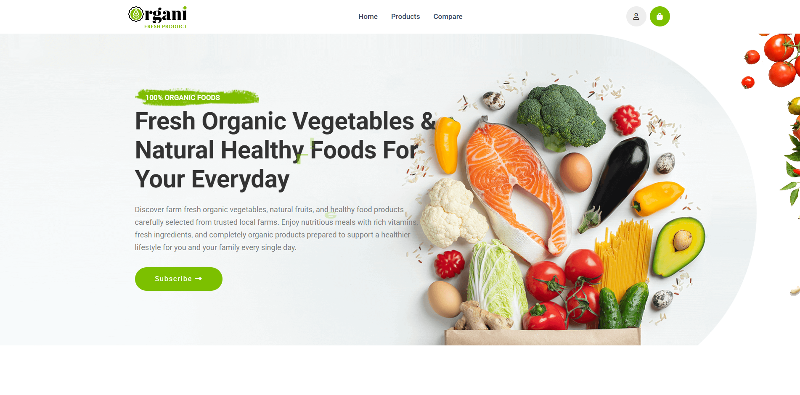
  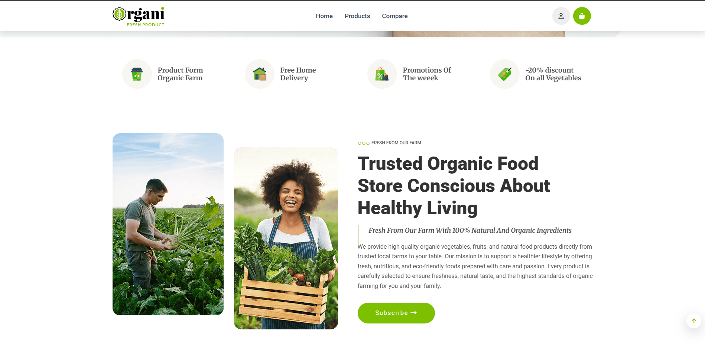
  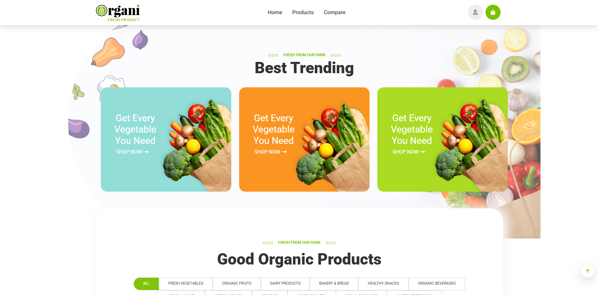
  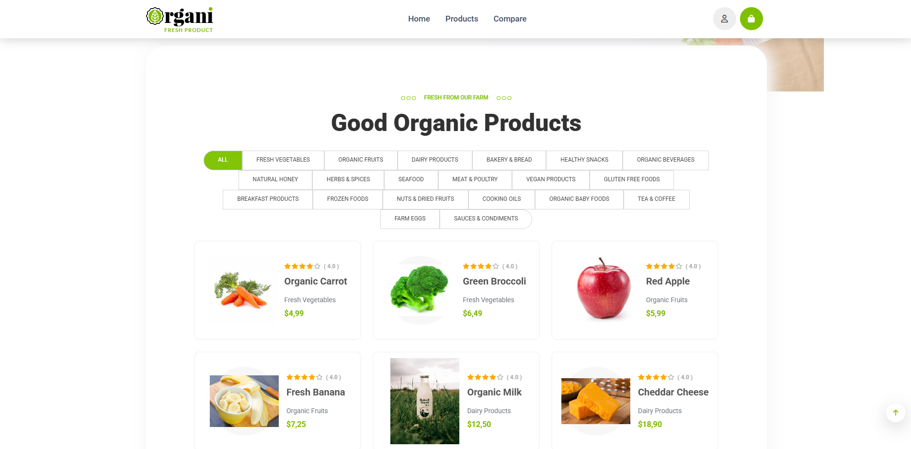
  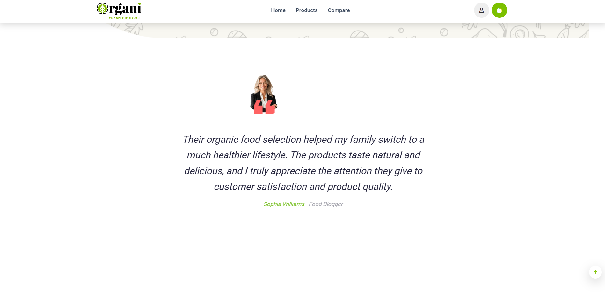
  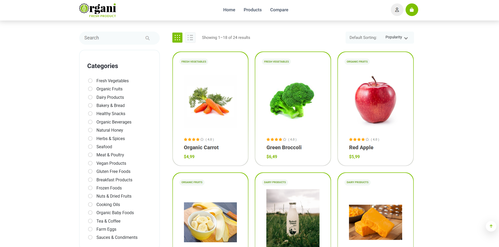
  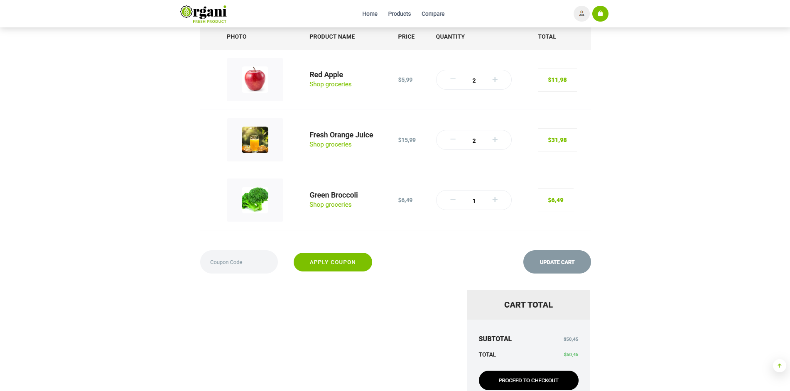
  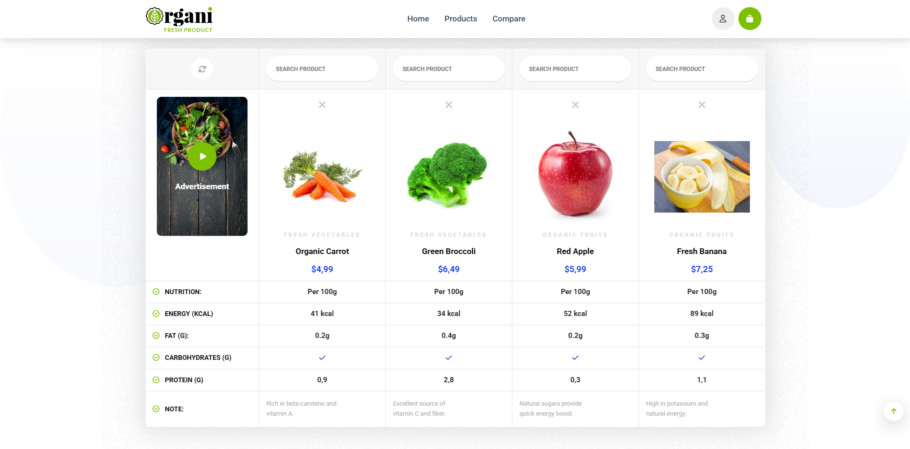
  
### 🔐 Admin Paneli

  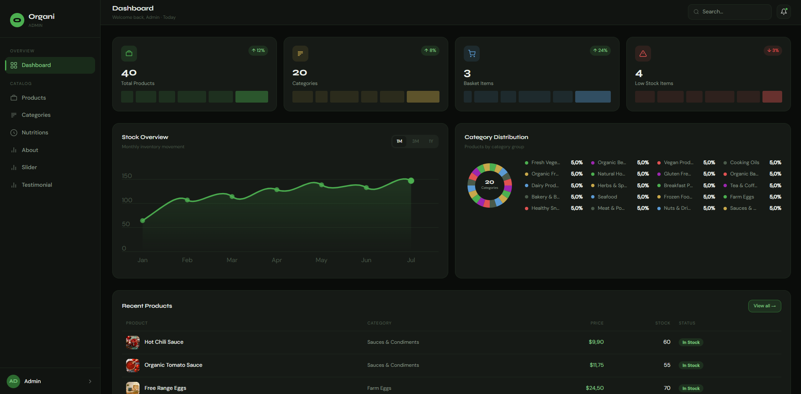
  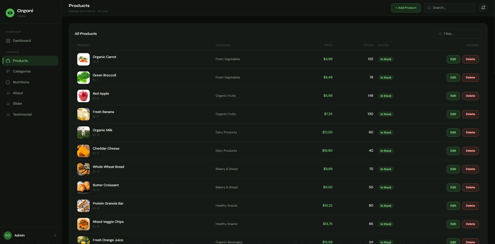
  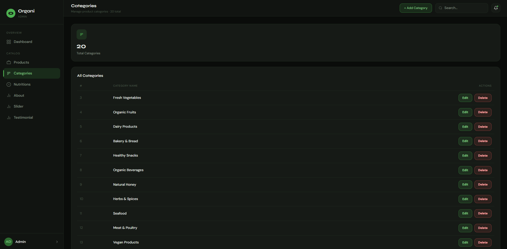
  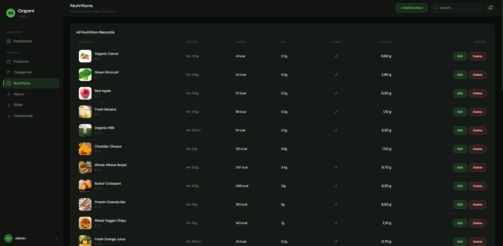
  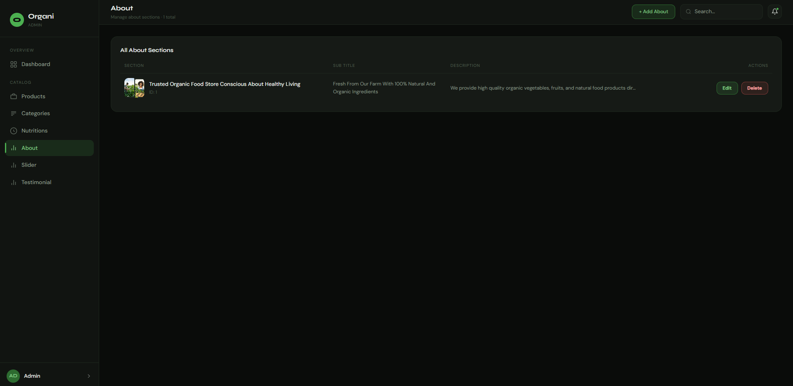
  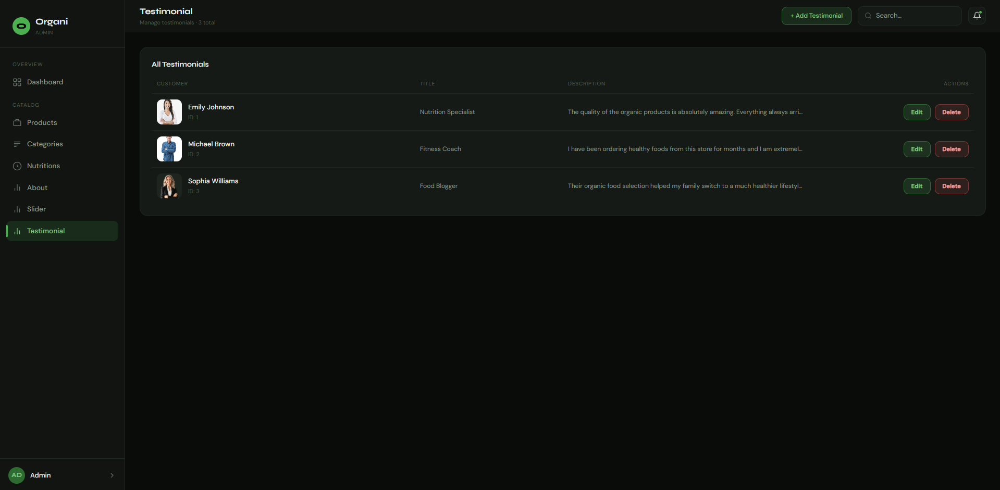
  
  

</div>

---
